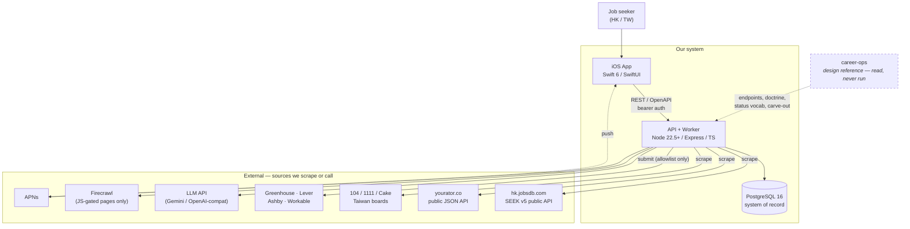
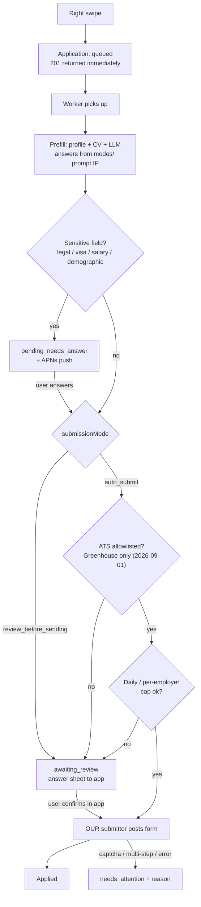

# Software Design Document: Swipe-to-Apply Job Search (HK/TW)

**Feature**: `001-job-swipe-apply` | **Version**: 3.1 | **Date**: 2026-08-31 | **Status**: Draft for review

**Related**: [spec.md](./spec.md) · [plan.md](./plan.md) · [research.md](./research.md) · [data-model.md](./data-model.md) · [contracts/openapi.yaml](./contracts/openapi.yaml) · [quickstart.md](./quickstart.md) · [compliance/](./compliance/) · [constitution](../../.specify/memory/constitution.md)

> **Why this document exists**: `plan.md` was written before career-ops was actually read. A
> source-level investigation invalidated three of its premises. This SDD is the corrected design;
> [Appendix A](#appendix-a-review-of-earlier-planning) records every finding and the correction
> applied, so the change is traceable rather than silent.
>
> **Rev 3 — career-ops is a design reference, not a runtime dependency.** We build the scrapers,
> the submitter, the CV parser, and the tracker ourselves. career-ops contributes *knowledge*:
> proven source endpoints, provider doctrine, a status vocabulary, and the sensitive-field
> carve-out. Nothing of it is spawned, mounted, or shipped. This removes the per-user workspace,
> the subprocess adapter, the whole-file-lock serialisation, and the Node ≥ 22.5 floor from rev 2,
> and it *lifts* rev 2's DOCX restriction, which was career-ops's limit and never ours.
>
> **Rev 3.1 — Phase 0 compliance research landed (2026-08-31) and it is not a clean pass.**
> Two premises load-bearing to §6.3's "Tier 1 is cheap" framing did not survive a real ToS/robots
> read: **JobsDB HK's ToS reserves automated access to a partner API** (R11) and **104.com.tw
> could not even be accessed** (R4). A previously-"resolved" decision reopened: the product's
> then-name, **Swipe2Work**, collided with an active third-party product, `swipe2work.ai`
> (Germany) — same swipe-to-apply-with-AI concept, nearly identical name. Full findings are in
> [`compliance/`](./compliance/), preserved as written at the time.
>
> **Product explicitly accepted the JobsDB HK ToS risk** (`compliance/risk-acceptance-log.md`,
> 2026-08-31) — T046 is built. 104.com.tw is **not** covered by that decision: its 403 is active
> bot detection, a narrower and larger question than a ToS risk, and remains open (B9).
>
> **Rev 3.2 — renamed Swipe2Work → Fyndra (2026-09-01).** Resolves R3/B4: a WebSearch across the
> swipe/hire/career naming space found the category saturated with live competitors (swipejobs.com,
> JobSwipe, SwipeHire, CareerSwipe, Roleup, Jobli, Workdeck all have real App Store listings, beyond
> the original swipe2work.ai finding) — no descriptive name in that space is likely to clear a real
> trademark search either. "Fyndra" returned no existing product/company; still only a WebSearch,
> not a registry search, so external use (App Store Connect, domain, marketing) still waits on one
> per B4. This document, the codebase, and the GitHub repository (now
> `github.com/bryanmak1011/fyndra`) are renamed throughout. `compliance/naming-attribution.md` is
> left as originally written — it is the historical record of *why* "Swipe2Work" was rejected, and
> renaming its references to "Fyndra" would make that record misleading.

---

## 1. Purpose & Scope

Design the system that lets a job seeker in **Hong Kong and Taiwan** upload a CV, receive a ranked
feed of relevant jobs, swipe left to reject / right to apply, have the application submitted or
prepared on their behalf, and track outcomes — with career-ops as the back-spine where career-ops
actually has something to give.

**In scope (Phase 1)**: iOS client, local Dockerized API + Postgres, HK/TW job sourcing, CV intake,
matching, both apply paths, status tracking.

**Out of scope (Phase 1)**: cloud deployment, App Store distribution (see §11.3), Android, employer-side
features, iPad.

---

## 2. Design Drivers

| # | Driver | Source | Consequence for design |
|---|---|---|---|
| D1 | **We own every runtime component.** career-ops is consulted, never executed | Product decision (rev 3) | No subprocess adapter, no mounted checkout, no per-user file workspace, no shared-lock serialisation. One codebase, one runtime. |
| D2 | **Nobody hands us a submitter.** career-ops refuses to submit by design | `web/src/lib/apply/session.ts`: *"NEVER clicks a submit/apply control"*; `LEGAL_DISCLAIMER.md` §5 lists auto-submit as unacceptable use | We build it, allowlist-gated to ATS with published schemas (§6.5). Its refusal is still a **signal**: the reason it refuses is our risk too (§12 R1). |
| D3 | **LinkedIn and Indeed are out.** Both prohibit automated access | career-ops has zero LinkedIn providers and rejects such contributions *"to respect third-party ToS"* | Excluded as sources and as application channels (§6.3, FR-009a). |
| D4 | **Proven HK/TW endpoints exist and are documented** | `providers/jobstreet.mjs`: `HK-Main → hk.jobsdb.com` on SEEK's public v5 search API; `providers/yourator.mjs`: `yourator.co/api/v4/jobs`, no auth | We write our own thin providers against those same public endpoints — the reference saved us the discovery work, not the implementation (§6.3). |
| D5 | **Provider doctrine is worth copying** | career-ops honours robots/Crawl-delay/429 and retired a provider rather than defeat its bot protection | Adopted verbatim as our own source rules (§6.3). Not a dependency — a standard. |
| D6 | **The hard part of applying is answering questions safely** | `web/src/lib/apply/answer-prompt.mjs`'s carve-out *"keeps legal, visa, work-authorization, salary and demographic questions from being auto-filled"* | Adopted as a hard rule and extended for HK/TW (§6.5.2). |
| D7 | Target market is **zh-Hant + English bilingual** | User direction (HK/TW) | CJK segmentation and cross-lingual matching are core, not localisation polish (§10.2). |
| D8 | Submission is **slow and failure-prone** (30 s–2 min, CAPTCHAs, multi-step) | Any form-filling automation | Swipe must return immediately; submission is a queued job (§4, §6.5). |
| D9 | Constitution is **iOS-only**; there are no backend principles | `.specify/memory/constitution.md` | Governance gap — amendment required (§12, R7). |

---

## 3. System Context



**Trust boundaries**: the iOS app is untrusted — all authorisation is server-side. Every external
host is untrusted input, including job-description text (§10.1, prompt injection). The dashed edge
carries no traffic: career-ops informed the design and is not deployed.

**What we deliberately did not inherit**: career-ops's file-canonical storage, its single-workspace
process model, its subprocess/agent-CLI execution shape, and its headed-Chrome apply flow. Each was
a good fit for a single developer's laptop and a poor fit for a multi-user mobile backend.

---

## 4. Architecture Overview

Three deployable units in Phase 1, all on the developer's machine:

| Unit | Runtime | Responsibility |
|---|---|---|
| `ios/Fyndra` | iOS 17+, Swift 6 | Presentation only. No business rules, no ranking, no scoring. |
| `api` | Node 22 LTS / Express / TS in Docker | Auth, REST contract, matching, sourcing orchestration, apply orchestration. |
| `worker` | same image, separate process | Queued long jobs: crawl, CV parse, match rebuild, submit, status poll. |
| `postgres` | Postgres 16 in Docker, named volume | System of record — single source of truth. |

**Why a worker and not just the API**: D8. A right-swipe that waited on a form submission would
blow the constitution's 300 ms transition budget by two orders of magnitude.

**Why this is simpler than rev 2**: with career-ops out of the runtime there is no per-user
filesystem workspace, no `CAREER_OPS_ROOT` process scoping, no whole-file lock forcing per-user job
serialisation, and no second storage model to reconcile. Postgres is simply the truth, and the
worker pool scales on ordinary queue semantics.

---

## 5. Module Map

```text
api/
├── src/
│   ├── routes/            # auth, profile, cv, feed, swipes, applications, questions, devices
│   ├── sourcing/
│   │   ├── providers/     # tw104, tw1111, cake, meetjobs, ctgoodjobs (all ours)
│   │   ├── jobsdb-hk.ts   # SEEK v5 public API, siteKey HK-Main
│   │   ├── yourator.ts    # yourator.co public JSON API v4
│   │   ├── firecrawl.ts   # JS-gated fallback only
│   │   └── normalise.ts   # → canonical JobPosting, employer-ATS dedup key
│   ├── matching/
│   │   ├── segment.ts     # CJK segmentation (zh-Hant) + EN tokenise
│   │   ├── taxonomy/      # bilingual skill synonyms (專案管理 ↔ project management)
│   │   └── rank.ts        # deterministic pre-rank; LLM eval on demand only
│   ├── apply/
│   │   ├── prefill.ts     # via career-ops answer prompts + our LLM call
│   │   ├── submit-ats.ts  # OUR submitter — allowlisted ATS only
│   │   ├── sensitive.ts   # carve-out: visa/work-auth/ID/salary/demographic → never auto-answer
│   │   └── handoff.ts     # non-allowlisted → answer sheet + deep link
│   ├── cv/
│   │   ├── extract.ts     # PDF text layer + DOCX; rejects scanned (no OCR in Phase 1)
│   │   └── interpret.ts   # LLM → keywords + YoE, per detected language
│   ├── llm/               # direct SDK calls; prompt patterns informed by career-ops modes/
│   ├── queue/             # crawl, parse-cv, rebuild-match, submit, poll-status
│   └── middleware/        # auth, validation, rate limits, error mapping
├── prisma/{schema.prisma,migrations/}
└── tests/{contract,integration,unit}/

ios/Fyndra/
├── App/                   # entry, BaseURLProvider (DEBUG: localhost|ngrok, RELEASE: cloud)
├── Features/{Profile,JobFeed,ApplicationTracking,Settings}/
├── Core/{Networking,Models,DesignSystem,Localization}/
└── Resources/{en.lproj,zh-Hant.lproj}/
ios/FyndraTests/{Unit,Snapshot,UITests}/
```

---

## 6. Component Design

### 6.1 iOS client

MVVM with `@Observable` (iOS 17 floor is set by `@Observable` itself). One view model per feature;
views hold no business logic. Networking is a hand-authored `URLSession` client against
[contracts/openapi.yaml](./contracts/openapi.yaml) — see `research.md` for why not codegen yet.

Per constitution III, every screen implements **loading / empty / error / success**. The swipe deck's
empty state matters more than usual: with a bounded HK/TW market the feed *will* run dry, and the
end-of-feed state is a designed screen, not an error (spec Story 2 AC 4).

Per constitution IV: all calls off the main thread, explicit timeouts (30 s connect / 60 s read),
exponential backoff, cancellation on view exit. Status is **pull-on-appear + pull-to-refresh**;
polling is prohibited by constitution IV, so freshness pushes arrive via APNs (§6.8).

### 6.2 Auth

The earlier contract had **no authentication at all** while FR-015 promised cross-device profiles.
Design: email + one-time code → opaque bearer token with a 30-day expiry and no refresh endpoint:
an expired client requests a new code. No password storage, no third-party IdP in Phase 1. Every route except `/auth/*` requires `Authorization: Bearer`.
Per-token rate limits at the middleware layer.

### 6.3 Sourcing subsystem

**Buy-before-build ladder.** Each tier is exhausted before the next is written.

We write every provider. career-ops's contribution here is **reconnaissance, not code**: it
documents which endpoints are public, unauthenticated, and stable, which is the expensive part to
discover.

| Tier | Source | Endpoint known from reference | Effort |
|---|---|---|---|
| 1 | **JobsDB Hong Kong** — HK's dominant board | `hk.jobsdb.com` on SEEK's public v5 search API, `siteKey=HK-Main` | thin JSON provider |
| 1 | **Yourator** — TW startup/digital roles | `yourator.co/api/v4/jobs`, no auth, no cookie; ~36% of rows carry the employer's own ATS URL | thin JSON provider |
| 1 | **ATS aggregation** (Greenhouse, Lever, Ashby, Workable, Workday…) — MNC roles located in HK/TW | Public per-tenant board APIs | one provider per ATS family |
| 2 | **104.com.tw** — dominant TW board, then 1111, Cake, Meet.jobs | Not covered by the reference; we research each | new provider each |
| 2 | **CTgoodjobs, cpjobs** (HK second tier) | Not covered; only if Tier 1 proves thin | new provider each |
| 3 | LinkedIn, Indeed | — | **Excluded** (D3) |

> **Tier 1 is cheap because the endpoints are already proven public JSON.** Tier 2 is the real
> engineering, and 104.com.tw is the single highest-value provider to get right — it is where most
> Taiwan candidates actually look.

**Provider method ladder** (adopted from career-ops's own doctrine):

1. **Public JSON endpoint the site's own web client calls** → thin deterministic Node provider,
   zero-token, no browser. This is how 83 existing providers work and how JobsDB/Yourator work.
2. **JS-gated only** → Firecrawl `/scrape` with schema extraction.
3. **Volume/cost forces self-hosting** → revisit Crawl4AI.

**Firecrawl over Crawl4AI for Phase 1.** Crawl4AI is Python; adopting it puts a second runtime and
a second container into a Node/TS stack and hands us proxy and anti-bot operations. Firecrawl is a
hosted call from the existing service. **Constraint: no CV or profile PII is ever sent to Firecrawl** —
it sees public job pages only.

**Non-negotiable source rules** (career-ops's posture, adopted verbatim as ours):

- Honour `robots.txt`, `Crawl-delay`, and `429 Retry-After`.
- **Never work around bot protection.** career-ops retired its EchoJobs provider for exactly this
  reason; a source that starts fighting us is dropped, not defeated.
- Dedup key = the **shortest verifiable employer path**. Yourator already resolves 36 % of rows to
  the employer's own ATS URL; that ATS URL is the dedup key, so the same role found via 104 and via
  Greenhouse collapses to one card.
- Strip `utm_*`; paid placement does not reach the candidate.

**Crawling is scheduled, never on the swipe path.** The worker crawls on a cron into
`job_posting`; the feed reads Postgres only. Liveness is re-checked before a card is shown (career-ops
`check-liveness.mjs`) to avoid the expired-posting edge case.

### 6.4 Matching & ranking

**Deterministic pre-rank at feed scale; LLM only on demand.** career-ops's 1–5 score is a *prompt*
(`modes/_shared.md` + `modes/oferta.md`), not an algorithm, and `rank-pipeline.mjs` annotates but
*"never filters, reorders, or deletes"*. Running an LLM over every posting to build a swipe feed
would be slow and expensive.

- **Pre-rank (zero-token, every posting)**: bilingual keyword overlap, title/role match, YoE
  band fit, location = HK/TW. Deterministic adjuncts that already exist and are reusable:
  `jd-skill-gap.mjs`, `skill-extract.mjs`, `title-keywords.mjs`, `role-matcher.mjs`,
  `classify-tier.mjs`, `fingerprint-core.mjs`/`detect-reposts.mjs`.
- **LLM evaluation (per posting, on demand)**: only on right-swipe, or user-requested "why this
  job?". Keeps cost proportional to intent.

Cross-lingual matching is the hard part — see §10.2.

### 6.5 Apply subsystem

Two paths, selected by `submissionMode` × source allowlist. **Auto-submit is allowlist-gated: it is
never attempted on a form we do not have a published schema for.**



#### 6.5.1 Review path — redesigned for mobile

career-ops's review path ends with a human clicking Submit in a **headed desktop Chrome window**
(D5). That cannot happen on a phone. Replacement:

- Server prefills and returns a **structured answer sheet** (field label, our proposed answer,
  confidence, source) to the app.
- User reviews and edits in-app.
- On confirm: allowlisted ATS → we POST it; non-allowlisted → the app deep-links to the employer
  form in Safari with the answer sheet available for paste, and the application is marked
  `handed_off` pending the user's own confirmation.

This preserves career-ops's *intent* (a human sees the application before it is sent) while working
on the actual target device.

#### 6.5.2 Sensitive-field carve-out (hard rule)

Adopted from career-ops's `answer-prompt.mjs`, whose carve-out *"keeps legal, visa,
work-authorization, salary and demographic questions from being auto-filled"*. These are **never**
auto-answered in either mode; they force `pending_needs_answer`. In HK/TW this list additionally
covers **HKID / 身分證字號**, right-to-work status, and 期望薪資 (expected salary).

#### 6.5.3 Volume discipline

career-ops's `LEGAL_DISCLAIMER.md` §4 forbids using it to *"spam employers, overwhelm ATS systems,
or submit mass applications"*. We inherit that as an enforced limit, not an aspiration: a per-user
daily submission cap and a per-employer cap, enforced server-side. This is also the cheapest
defence against the account-ban and App-Store-review risks in §12.

### 6.6 What we took from career-ops, and what we left

career-ops is read, cited, and not deployed. Concretely inherited:

| Inherited | Where it lands | Why it was worth taking |
|---|---|---|
| **Proven public endpoints** for JobsDB HK and Yourator TW | `sourcing/providers/` (our code) | Endpoint discovery is the slow, brittle part of scraping; this is weeks saved |
| **Provider doctrine** — robots/Crawl-delay/429, never defeat bot protection, drop a source instead | `sourcing/` review checklist (§6.3) | A defensible, already-reasoned position on the exact legal exposure we carry |
| **Dedup on the employer's own application URL** | `normalise.ts` | Collapses the same role found via a board and via the employer's ATS |
| **Sensitive-field carve-out** | `apply/sensitive.ts` (§6.5.2) | The single most important safety rule in the apply flow |
| **Status vocabulary shape** | `Application.status` (§7) | A sane, already-validated pipeline model |
| **Prompt patterns** in `modes/` (MIT-licensed text) | `llm/` prompts | Structure for CV interpretation and answer drafting |

Deliberately **not** inherited: the file-canonical store, single-workspace process model,
subprocess/agent-CLI execution, headed-Chrome apply flow, and the tracker's `node:sqlite`
dependency (which is what forced rev 2's Node ≥ 22.5 floor — now back to plain Node 22 LTS).

**Attribution**: career-ops is MIT-licensed, and we ship none of its code. Where we adapt its
prompt text, the source is credited in-repo. Its **name is not licensed for product naming**
(`TRADEMARK.md`), which is a task for the Functional Analyst, not an engineering constraint (§12 R3).

### 6.7 LLM usage

We call an LLM **directly via SDK** (Gemini or any OpenAI-compatible endpoint), with prompt
structure adapted from career-ops's `modes/` text. We do **not** spawn an agent CLI per request:
that shape is built for a developer's laptop, and career-ops's own web app has to budget 800 s for
such a call.

- LLM touchpoints: CV keyword/YoE interpretation (once per upload), application answer drafting
  (once per application), optional per-job evaluation on user intent. All queued, none on a
  synchronous request path.
- Everything else stays deterministic: sourcing, de-duplication, keyword overlap, ranking at feed
  scale, status bookkeeping. A model is never in the path of showing a card.

### 6.8 Notifications

FR-029 requires telling the user *outside the app* when an application needs their answer, needs
attention, or reaches a terminal outcome. Pull-only cannot; polling is prohibited by constitution
IV. → **APNs token-based push from the worker** on
`pending_needs_answer` / `needs_attention` / terminal status change, degrading to an in-app badge
when push permission is denied. Permission is requested contextually at first right-swipe, not at
launch (constitution V).

---

## 7. Data Design

Entity detail is in [data-model.md](./data-model.md). Design deltas introduced by this SDD:

1. **Status vocabulary** — pre-submission: `queued`, `awaiting_review`, `pending_needs_answer`,
   `handed_off`, `needs_attention`; post-submission: `applied`, `responded`, `interview`, `offer`,
   `hired`, `rejected`, `withdrawn`. The shape follows career-ops's `states.yml`, but rev 2's
   `Evaluated` and `SKIP` are **dropped** — their only justification was mirroring into
   career-ops's tracker, and both are already representable: an unswiped posting has no
   Application, and a left-swipe is a `JobInteraction` with `direction = left`. Casing is
   normalised to lower snake_case, since there is no longer an external vocabulary to match.
2. **`JobPosting` gains** `sourceProvider`, `employerApplyUrl` (dedup key), `language`
   (`zh-Hant`/`en`/mixed), `market` (`HK`/`TW`), `livenessCheckedAt`. Per-user `matchScore` moves
   to a new `FeedEntry` join entity — ranking belongs to the (profile, posting) pair, not the posting.
3. **`UserProfile` gains** `preferredLanguage`, `markets[]`, and `dailySubmissionCap`.
4. **`ApplicationQuestion` gains** `isSensitive` — set by the §6.5.2 carve-out, and answers to
   sensitive questions are **never** reused across applications even though ordinary answers are
   (FR-021).
5. **PII partitioning**: CV files and parsed CV text live in a separate store with its own
   retention clock, referenced by `storageRef`, so a deletion request is one operation (§10.1).

---

## 8. Interface Design

REST, OpenAPI-first, in [contracts/openapi.yaml](./contracts/openapi.yaml). Corrections this SDD
forces on the earlier contract:

| Change | Why |
|---|---|
| Add `/auth/request-code`, `/auth/verify`; bearer security on all other routes | Contract previously had no auth at all while FR-015 promised cross-device profiles |
| `POST /jobs/{id}/swipe` returns `202` with `status: queued`, never a submission result | D8 — submission takes 30 s–2 min; a synchronous swipe breaks the 300 ms budget |
| `POST /applications/{id}/handoff-complete` | §6.5.1 non-allowlisted path needs the user to report their own submission |
| `POST /devices` (APNs token registration) | §6.8 |
| Status enum realigned to §7 item 1 | career-ops `states.yml` |
| `ApplicationQuestion.isSensitive` exposed | so the client can label *why* it is asking |

**Migration control preserved**: no field in the contract is iOS-specific. Push registration is
confined to `POST /devices`, whose `platform` enum names the push *transport* (`apns`/`fcm`), not
the client platform; no domain payload carries an Apple-shaped type. The same contract serves an
Android client unchanged.

---

## 9. Key Flows

**CV intake.** Upload → validate → object store → worker: text extraction → LLM interpretation to
keywords + YoE → user confirms/edits (FR-003, never applied silently) → profile updated → match
rebuild queued.

> **Format scope restored in rev 3**: rev 2 limited intake to text-layer PDF because *career-ops's*
> `intake.mjs` excludes DOCX. We now own extraction, so that limit is not ours to inherit —
> **PDF (text layer) and DOCX are both supported**. Scanned/image-only PDFs stay out of scope
> (they need OCR, a Phase 2 decision) and are rejected at upload with a message naming the reason
> rather than being silently half-parsed.

**Feed build.** Cron crawl (Tier 1 via career-ops providers, Tier 2 via ours) → normalise → dedup on
`employerApplyUrl` → liveness check → deterministic pre-rank against the profile → `feed_entry` rows.
`GET /jobs/feed` is a Postgres read excluding every posting with an existing `JobInteraction`
(FR-014, unique on `(profileId, jobPostingId)` — which also absorbs the duplicate-right-swipe-after-reinstall
edge case as an upsert).

**Right swipe.** See §6.5 diagram. Returns `202` in well under 300 ms; everything else is the worker.

**Status progression.** Post-submission status is **user-reported** in Phase 1: the tracking view
lets the user mark an application `responded`, `interview`, `offer`, `hired`, or `rejected`.
Automated detection (mailbox scanning for employer replies — the pattern career-ops implements with
`reply-watch.mjs` / `invite-match.mjs`) is deferred to Phase 2: it needs mailbox access, which is
its own consent, privacy, and scope decision.

---

## 10. Cross-Cutting Concerns

### 10.1 Security & privacy

| Concern | Design |
|---|---|
| **CV = PII** | Separate store, encrypted at rest, own retention clock, one-operation delete. Never sent to Firecrawl or any third party that isn't the employer receiving the application. |
| **HK/TW law, not GDPR** | HK **PDPO** and TW **PDPA** govern. Both require purpose limitation, consent for the actual use, and a real access/erasure path. Published privacy policy is an App Store prerequisite anyway. |
| **HKID / 身分證字號** | Classified sensitive: never auto-filled, never LLM-drafted, never reused across applications (§6.5.2). |
| **No credential custody** | We do **not** store employer-site or platform passwords. Auto-submit targets public ATS endpoints that accept an application without a candidate login. This is a deliberate boundary: the moment we hold a user's LinkedIn password we own a breach-grade secret, and D2 removed the only reason to want one. |
| **SSRF** | Every provider pins a host allowlist before fetching, and a URL from remote content is never fetched on that content's authority alone — career-ops's `assertJobstreetUrl` / `assertYouratorUrl` pattern, adopted as ours. |
| **Prompt injection from job descriptions** | JD text is untrusted input to every LLM call. career-ops already treats scraped profile text as untrusted data in `modes/contacto.md`; we adopt the same posture — JD content is data, never instructions, and never authorises a submission. |
| **PrivacyInfo.xcprivacy** | Required (constitution V) — the app collects CV/PII. |

### 10.2 Internationalisation — the underestimated risk

The market is bilingual zh-Hant/English, and this reaches further than string files:

- **CJK has no whitespace word boundaries.** Any extractor built on whitespace tokenisation — the
  English-oriented approach career-ops takes included — **silently under-extracts** on Chinese,
  returning plausible-looking near-empty results instead of failing. Mitigation: CJK segmentation
  (jieba-class or ICU) before any keyword operation, plus tests asserting non-empty extraction on
  zh-Hant fixtures.
- **Cross-lingual matching**: an English CV against a Traditional Chinese JD. Mitigation: a curated
  **bilingual skill taxonomy** (專案管理 ↔ project management, 後端工程師 ↔ backend engineer) for
  deterministic feed-scale matching, with multilingual embeddings as the Phase 2 upgrade.
- **YoE in Chinese**: patterns like `3年經驗`, `5 年以上工作經驗` — distinct extraction rules.
- **iOS**: `en` + `zh-Hant` from day one. CJK Dynamic Type, line-breaking, and truncation on a
  swipe card are genuinely different from Latin text; snapshot tests (constitution II) must cover
  zh-Hant at large accessibility sizes, not just English at default size.

### 10.3 Observability & error handling

Structured logs with a correlation id per queued job, propagated to the client as
`Application.lastAttemptRef` so a "needs attention" is diagnosable. Submission failures are
**classified**, never generic: `captcha_detected`, `multi_step_form`, `site_error`, `cap_reached`
— the distinction career-ops draws in `diagnose.ts`, because "it failed" tells a user nothing about
whether to apply manually (FR-013).

### 10.4 Performance

Client budgets are the constitution's, unchanged (cold launch ≤ 2 s, transitions ≤ 300 ms,
≤ 150 MB, off-main-thread I/O). Server: feed and status reads served from Postgres, p95 ≤ 300 ms
locally; all slow work queued. Feed pre-fetches the next N cards so swiping never awaits the network.

---

## 11. Deployment & Environments

### 11.1 Phase 1 topology

`docker compose` brings up `postgres`, `api`, and `worker` — three services, no mounted external
checkout. The image needs Node 22 LTS, a PDF text extractor, and (once Tier-2 sourcing requires it)
Playwright chromium.

### 11.2 Base-URL switching (migration control, as specified)

| Build config | Base URL |
|---|---|
| DEBUG, Simulator | `http://localhost:3000/v1` |
| DEBUG, physical device | ngrok tunnel URL from scheme env var |
| RELEASE | cloud endpoint — **does not exist in Phase 1** |

### 11.3 Consequence to state plainly

Because RELEASE has no endpoint, **Phase 1 cannot produce a TestFlight or App Store build**. A
laptop-hosted backend is not distributable. Phase 1's exit criterion is a working device demo, and
cloud deployment is Phase 2's first task — not a detail to discover at submission time.

---

## 12. Risk Register

| # | Risk | Sev | Mitigation |
|---|---|---|---|
| R1 | **App Store rejection** for automating third-party services / employment-application handling | High | Auto-submit restricted to allowlisted public ATS endpoints with no credential custody and no ToS-prohibited platform (§6.5, §10.1); volume caps (§6.5.3); no LinkedIn/Indeed automation at all (D2). Guideline 5.2.2 requires proof of authorization on request; **Phase 0 finding (2026-08-31, `compliance/app-store-assessment.md`)**: confirmed for the *reading* side (documented Job Board APIs), but the *submission* side needs a per-ATS terms confirmation before T067 — mitigation is conditional, not fully closed. |
| R2 | **We are building what our design reference refuses to build.** career-ops declines auto-submit as unacceptable use | High | Owned by us end-to-end, so no licence or contribution question arises — but the *reason* for its refusal (ToS exposure, employer-side harm) applies to us regardless of who wrote the code. Mitigated by the ATS allowlist, no credential custody, volume caps, and a Functional Analyst compliance review (T0-series tasks). |
| R12 | **Auto-submit allowlist is Greenhouse-only, not "the 4 ATS platforms"** — a premise this design carried since rev 1 didn't survive checking live | **New (2026-09-01), superseded by R13 below** | T064 verified each ATS's form-schema API before writing a reader (same discipline R11/JobsDB HK taught): only Greenhouse's is genuinely public. Lever's own docs disclaim exposing custom questions; Ashby's schema needs basic auth + `jobsRead`; Workable's form-fields endpoint is part of its authenticated employer API. |
| R13 | **No ATS has a genuinely public *submission* API either — not even Greenhouse.** The entire "auto-submit via clean API calls" premise (D2, §6.5) is unconfirmed for every current provider | **Critical, new (2026-09-01) — build paused pending Product decision, see `BLOCKERS.md`** | Checked Greenhouse's own documented submission endpoint directly: it requires HTTP Basic Auth with an API key from the *employer's own* Greenhouse "API Credentials" page — a private, per-organization credential, not the public board token. The only remaining path to real submission on any of the 4 platforms is driving the actual candidate-facing web form — real browser automation, which is exactly what career-ops's design refuses to do (D2) and what this SDD assumed we'd avoid. `apply-route.ts`'s `direct_submit_allowlisted` route has **no confirmed real target right now** for any provider. T067 (the submitter) is not built pending a Product decision on `BLOCKERS.md`'s three options: accept handoff-only, pursue employer API partnerships, or explicitly accept browser-automation risk. |
| R3 | **Trademark** — product naming | **Medium (renamed 2026-09-01, search still owed)** | The prior name, Swipe2Work, collided with `swipe2work.ai` (Germany, same concept, nearly identical name — `compliance/naming-attribution.md`). Renamed to **Fyndra**; the wider descriptive-name space (swipe/hire/career combos) proved saturated with live competitors during the search that surfaced the replacement, which is itself informative about this risk category. A WebSearch is still not a trademark clearance — a real search (EUIPO/USPTO/HK-TW registries) is needed before any external use of "Fyndra". Appendix B4 updated accordingly. |
| R4 | **104.com.tw anti-bot / ToS** | High → **Accepted, proceeding** | Direct fetch abandoned; 403 on every attempt (see history below) never got resolved on its own terms. **2026-09-10, risk-acceptance-log.md**: Product explicitly directed sourcing 104.com.tw via a third-party Apify actor (`youfuxu/taiwan-104-job-scraper`) instead — confirmed live to use real browser automation, i.e. it defeats 104.com.tw's bot detection on our behalf. This is the circumvention decision the entry below (2026-08-31) said was still open; it has now been made, explicitly, by Product. History: robots.txt, homepage, and ToS all returned HTTP 403 to every direct-fetch attempt during the Phase 0 compliance review (2026-08-31); Product separately accepted the *ToS* risk generally for HK/TW sourcing the same day, but that acceptance was explicitly narrower — direct 403-defeat was called out as a distinct, not-yet-made decision at the time. |
| R5 | **CJK matching silently degrades** (§10.2) | High | Segmentation before keyword ops; test fixtures in zh-Hant with asserted non-empty extraction, so degradation fails a test instead of shipping. |
| R6 | **Feed runs dry** in a bounded two-city market | **High (raised from Med, 2026-08-31)** | The "Tier 1 breadth first" mitigation assumed JobsDB HK was cheap and proven; **Phase 0 finding**: JobsDB HK is **NO-GO as designed** (R11) — its ToS reserves automated access to a partner API we don't have. HK-market breadth now rests on ATS providers alone (MNC roles) plus whatever HK second-tier sources clear NEEDS-LEGAL-REVIEW. Designed end-of-feed state and broaden-criteria prompt remain in place, but the "breadth" half of the mitigation is materially weaker than assumed until R11 resolves. |
| R7 | **No backend governance** — constitution is iOS-only (D9) | Med | Run `/speckit-constitution` to add server principles before implementation; until then the iOS principles apply by analogy and that gap is recorded, not hidden. |
| R8 | **LLM cost/latency** per application and per CV | Med | Deterministic pre-rank at feed scale; LLM only on intent (§6.4). Budget alarm per user per day. |
| R9 | **Source endpoint churn** — public JSON endpoints are undocumented and can change without notice | Med | One provider per source behind a common interface; provider contract tests with recorded fixtures; a failing provider degrades the feed rather than breaking the app. career-ops's own retirement of a broken provider is the model: drop it, don't fight it. |
| R10 | **Employer-side harm** — a swipe UI makes low-quality mass applying trivially easy | Med | Volume caps (§6.5.3) — **Phase 0 set concrete defaults**: 15/day per user, 1 concurrent per employer, `handed_off` applications excluded from both (`compliance/volume-policy.md`) — plus a match-quality floor before a job is even shown, and no "apply to all". This is a product-integrity risk, not only a legal one. |
| R11 | **JobsDB HK scraped against its ToS** — accepted risk, not a resolved finding | **High — risk accepted, proceeding (2026-08-31, `risk-acceptance-log.md`)** | `compliance/source-assessment.md` §1: ToS §7(b)(iv)/§9(b)(i) explicitly reserve automated access to a documented partner API; the public v5 search endpoint this design uses is not that partner API. Product explicitly directed engineering to build against it anyway. This is a live ToS/contract risk (rate-limit, IP-block, cease-and-desist), not a technical barrier — the endpoint answers normally. T046 unblocked and built. |

---

## 13. Phasing

| Phase | Content | Exit criterion |
|---|---|---|
| **0** | Compliance: per-source ToS review, App Store guideline assessment, PDPO/PDPA retention policy, trademark clearance | Functional Analyst sign-off; sourcing and auto-submit unblocked |
| **1a** | Auth, CV intake (PDF + DOCX), profile confirm, Tier-1 sourcing (JobsDB HK + Yourator + ATS), deterministic pre-rank, swipe feed | Device demo: upload CV → swipe a real HK/TW feed |
| **1b** | Apply: review path + answer sheet, sensitive carve-out, status list/timeline, user-reported status, APNs | Device demo: right swipe → reviewed submission → status visible |
| **1c** | Auto-submit for allowlisted ATS (Greenhouse only — see R12), volume caps, 104.com.tw provider | Auto-submit succeeds on a real Greenhouse posting within caps |
| **2** | Cloud deployment, TestFlight, remaining TW/HK providers, multilingual embeddings, scanned-PDF OCR, mailbox-based status detection | Distributable build |

---

## Appendix A: Review of earlier planning

Findings from reading career-ops at source, and what changed. Items marked **✗ premise invalid**
were factually wrong in the artifacts I generated earlier.

| # | Earlier claim | Finding | Correction |
|---|---|---|---|
| 1 | FR-009: apply to jobs "sourced from LinkedIn or Indeed" | **✗ premise invalid.** Zero LinkedIn providers; Indeed only via paid opt-in Apify plugin | FR-009 rewritten; both excluded (D2, §6.3) |
| 2 | FR-008/plan: career-ops performs headless-browser submission | **✗ premise invalid.** It refuses to click submit, in code and in `LEGAL_DISCLAIMER.md` §5 | We own the submitter, allowlist-gated (§6.5) |
| 3 | Plan: "headless-browser automation" in a Docker service | **✗ premise invalid.** Their flow is *headed* Chrome needing a desktop session, ending in a human click | Review path redesigned for mobile (§6.5.1) |
| 4 | Contract: `POST /swipe` returns the Application synchronously | Submission takes 30 s–2 min; their own web app budgets 800 s | `202 queued` + worker (§4, §6.5, §8) |
| 5 | Contract: no authentication whatsoever | FR-015 promises cross-device profiles | Bearer auth added (§6.2, §8) |
| 6 | Spec assumption: "PDF and DOCX supported" | `intake.mjs` excludes `.docx` and scanned PDFs | Text-layer PDF only in Phase 1 (§9) |
| 7 | Spec: invented status enum (`viewed`, `interview_requested`) | `templates/states.yml` is canonical and its analytics depend on it | Aligned to states.yml (§7 item 1) |
| 8 | Plan: "Node.js LTS" | `tracker.mjs` needs `node:sqlite` → **Node ≥ 22.5** | Pinned (§6.6) |
| 9 | Plan: no LLM anywhere in the architecture | Keyword/YoE mapping, answer drafting, and scoring are all model-dependent prompts | LLM subsystem added (§6.7) |
| 10 | Plan: "career-ops-client module" wraps it | Understated: no API, process-global root, whole-file locks, file-canonical state | Full adapter design (§6.6) |
| 11 | FR-013: notify on failure | Pull-only can't; polling is prohibited | APNs (§6.8) |
| 12 | Assumption: HK/TW uncovered, build both | **JobsDB HK already wired** (`siteKey: HK-Main`); **Yourator TW exists** | Scope cut to chiefly 104.com.tw (§6.3) |
| 13 | No i18n consideration | CJK breaks whitespace tokenisation silently | §10.2 promoted to a core risk (R5) |
| 14 | No risk register; ToS/App Store unaddressed | career-ops's own legal position is explicit and relevant | §12 |
| 15 | Plan: RELEASE → "future cloud endpoint" | Means no distributable build in Phase 1 | Stated as an exit constraint (§11.3) |
| 16 | Constitution check passed without noting backend gap | Constitution is iOS-only | R7 + amendment action |
| 17 | `ios/` tree put `FyndraTests/` outside the app tree | Structural error | Fixed (§5) |

**Not changed on review** (deliberate): iOS 17 floor (required by `@Observable`; broader than the
constitution's two-version policy, and it resolves the constitution's `TODO(MIN_IOS_VERSION)`);
MVVM + `@Observable`; hand-authored URLSession client; Postgres/Prisma; ngrok for device debugging;
per-user configurable submission mode.

### Rev 3 changes — career-ops demoted to design reference

| # | Rev 2 | Rev 3 |
|---|---|---|
| 18 | career-ops spawned per user over a per-user file workspace | **Removed.** No subprocess, no workspace, no `CAREER_OPS_ROOT`, no whole-file-lock job serialisation (§4, §6.6) |
| 19 | Status mirrored into career-ops's tracker via `set-status.mjs` | **Removed.** Postgres is simply the truth; `Evaluated` and `SKIP` dropped from the enum since mirroring was their only justification (§7) |
| 20 | Node ≥ 22.5 hard floor (career-ops's `node:sqlite` tracker) | **Node 22 LTS.** The floor was inherited, not ours |
| 21 | Text-layer PDF only (career-ops's `intake.mjs` excludes DOCX) | **PDF + DOCX.** We own extraction, so we own the format list. Scanned PDFs still need OCR — Phase 2 (§9) |
| 22 | HK/TW Tier 1 = "one `portals.yml` entry" reusing career-ops providers | We write thin providers against the same **public endpoints** career-ops documented. Reconnaissance reused, not code (§6.3) |
| 23 | career-ops's `web/` treated as an RCE risk to contain | **Not applicable** — nothing of career-ops is deployed (§10.1) |
| 24 | Employer replies detected via career-ops's reply loop | **User-reported status** in Phase 1; mailbox scanning deferred to Phase 2 with its own consent scope (§9) |
| 25 | Product name undecided (open decision B4) | Rev 3.1: named **Swipe2Work**, from the project repository — reopened B4 same day when it collided with `swipe2work.ai`. Rev 3.2 (2026-09-01): renamed to **Fyndra** after a wider search found the whole descriptive-name category saturated. A real trademark clearance search is still owed before external use (B4 stays open for that reason, just no longer blocking internal work). |

---

## Appendix B: Open decisions

| # | Decision | Owner | Blocks |
|---|---|---|---|
| B1 | Per-source ToS/robots assessment | **Done** (2026-08-31, `compliance/source-assessment.md`) — 4 of 12 sources GO (Yourator, 4× ATS-read), 2 NO-GO outright (JobsDB HK, cakeresume.com), 1 moot (meet.jobs shut down), 4 NEEDS-LEGAL-REVIEW (104.com.tw, ctgoodjobs.hk, cpjobs.com, 1111.com.tw) | §6.3, R4, R11 |
| B2 | LLM provider + budget per user/day | Product | §6.7 |
| B3 | Constitution amendment for backend principles (`/speckit-constitution`) | Tech lead | R7 |
| B4 | Product name | **Renamed to Fyndra** (2026-09-01) after Swipe2Work was found to collide with `swipe2work.ai` (`compliance/naming-attribution.md`). A **real trademark clearance search is still owed** before any external use — a second WebSearch informing the rename is not a substitute, it only found no *obvious* collision. | R3 |
| B5 | Retention period for CV/PII under HK PDPO and TW PDPA | **Resolved** (2026-08-31) — account deletion + 30 days, then hard delete (`compliance/privacy-policy-requirements.md` §4) | §10.1 |
| B6 | Whether `handed_off` applications count against volume caps | **Resolved** (2026-08-31) — excluded from both caps (`compliance/volume-policy.md` §3) | §6.5.3 |
| B7 | Whether scanned-PDF OCR enters Phase 2 scope | Product | §9 |
| B8 | JobsDB HK sourcing strategy | **Resolved (2026-08-31)** — Product accepted the ToS risk; scrape the public v5 endpoint. Recorded in `risk-acceptance-log.md`. No SEEK partnership pursued. | R11, R6 |
| B9 | 104.com.tw — why does every request 403? | **Resolved 2026-09-10, by product decision rather than by diagnosing the 403.** Direct fetch abandoned in favour of a third-party Apify actor (`youfuxu/taiwan-104-job-scraper`) that already handles it via browser automation — see risk-acceptance-log.md's 2026-09-10 entry. The underlying "why does it 403" question was never actually answered; it's moot now that we no longer fetch the site directly. | R4 |

Compliance and trademark items are now tracked as **Phase 0 tasks owned by the Functional Analyst**
in [tasks.md](./tasks.md) — they gate the sourcing and auto-submit work rather than sitting in a
document nobody owns.
