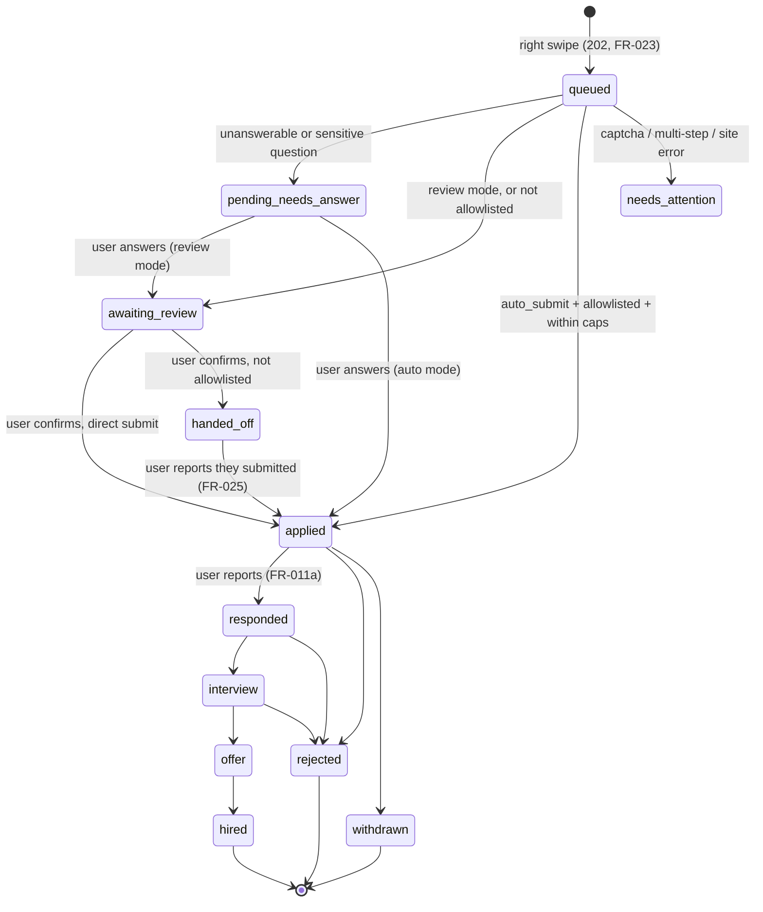

# Phase 1 Data Model: Swipe-to-Apply Job Search

**Revised 2026-08-31 (rev 3)** — career-ops is a design reference only, so the status vocabulary is
now ours (lower snake_case; `Evaluated`/`SKIP` dropped) and DOCX is supported again. See
[SDD §7](./SDD.md#7-data-design) for the rationale behind each delta.

Entities below are owned by the `api` Postgres database (via Prisma) and mirrored as Swift value
types in `ios/Fyndra/Core/Models` via the API contract. Field lists are the fields this feature
needs — not an exhaustive schema.

Postgres is the **only** store and the single source of truth. Nothing is mirrored to or read from
an external workspace.

## UserProfile

Represents a job seeker's account and derived profile.

| Field | Type | Notes |
|---|---|---|
| id | UUID | Primary key |
| email | string | Unique, used as account identity |
| createdAt / updatedAt | timestamp | |
| yoe | int | Years of experience; user-editable after extraction (FR-003) |
| keywords | string[] | Categorized skill keywords; user-editable after extraction |
| submissionMode | enum(`review_before_sending`, `auto_submit`) | Default `review_before_sending` (FR-018) |
| markets | enum[] (`HK`, `TW`) | Which markets this user's feed draws from (FR-016c) |
| preferredLanguage | enum(`zh-Hant`, `en`) | Defaults to device language, user-overridable; drives UI and answer drafting (FR-028) |
| dailySubmissionCap | int | Volume discipline (FR-024) |
| perEmployerCap | int | Max concurrent applications to one employer (FR-024) |

`submissionsUsedToday` is exposed on the API's profile response but is **derived** (a count of
today's submitted Applications), not a stored column.

**Relationships**: one `UserProfile` → one current `CvDocument` (latest supersedes prior, per
spec Assumption) → many `JobInteraction` → many `Application`.

**Validation**: `yoe >= 0`; `keywords` non-empty after a successful CV parse; `submissionMode`
change does not retroactively affect in-flight `Application`s (FR-019).

## CvDocument

The uploaded resume and its parsed output.

| Field | Type | Notes |
|---|---|---|
| id | UUID | Primary key |
| profileId | UUID | FK → UserProfile |
| fileFormat | enum(`pdf`, `docx`) | Text-layer PDF and DOCX. Scanned/image-only PDFs are rejected — they need OCR, out of scope for v1 (FR-001) |
| storageRef | string | Pointer to stored file, in the PII-partitioned store with its own retention clock |
| detectedLanguage | enum(`zh-Hant`, `en`, `mixed`)? | Selects the segmentation and extraction path (FR-027) |
| rawExtractedKeywords | string[] | Pre-correction extraction, kept for audit/reprocessing |
| rawExtractedYoe | int? | Nullable — parse may fail to detect YoE |
| parseStatus | enum(`parsing`, `succeeded`, `failed`) | Format and text-layer rejections happen synchronously at upload (`422`, naming `unsupported_format` / `no_text_layer` / `password_protected`) and never create a row |
| languageSegmenter | enum(`cjk`, `whitespace`) | Which tokenisation ran; asserted in tests so zh-Hant never silently falls through to whitespace |
| createdAt | timestamp | |

**Validation**: A new upload creates a new `CvDocument` row and updates `UserProfile.keywords`/
`yoe` only after the user confirms/edits (FR-003) — raw extraction is never applied silently.
Extraction on a `zh-Hant` document MUST run CJK segmentation first; an empty keyword set from a
non-empty Chinese CV is a defect, not a valid result (SDD R5).

## JobPosting

A job listing collected by one of our providers (`jobsdb-hk`, `yourator`, `tw104`, the ATS
families). Postgres is the source of truth for everything the app serves; the provider is the
origin, not the authority.

| Field | Type | Notes |
|---|---|---|
| id | UUID | Primary key |
| sourceProvider | string | e.g. `jobsdb-hk`, `yourator`, `tw104`, `greenhouse`. Replaces rev 1's `sourcePlatform` — LinkedIn and Indeed are not sources (FR-009a) |
| employerApplyUrl | string? | The employer's own application URL. **De-duplication key** — the same role found via a Taiwan board and via Greenhouse collapses to one card (FR-016b) |
| externalRef | string | Provider's identifier for this posting |
| title, employer | string | |
| requirementsSummary | string | Used for feed relevance display |
| language | enum(`zh-Hant`, `en`, `mixed`) | Selects the matching path (FR-027) |
| market | enum(`HK`, `TW`) | Feed filter (FR-016) |
| applyRoute | enum(`direct_submit_allowlisted`, `handoff`) | Whether our submitter can post this form, or the user must (FR-009/FR-025) |
| fetchedAt | timestamp | Feed freshness |
| livenessCheckedAt | timestamp | Re-checked before a card is shown, to avoid the expired-posting edge case |

## FeedEntry

The per-user ranking of a posting. Ranking is a property of the **(profile, posting) pair**, not of
the posting — two users see different scores for the same job, so it cannot live on `JobPosting`.

| Field | Type | Notes |
|---|---|---|
| id | UUID | Primary key |
| profileId | UUID | FK → UserProfile |
| jobPostingId | UUID | FK → JobPosting |
| matchScore | float | Deterministic pre-rank result; no LLM at feed scale (SDD §6.4) |
| rankedAt | timestamp | Recomputed when the profile changes or new postings arrive |

**Validation**: Unique on `(profileId, jobPostingId)`. The feed query reads `FeedEntry` ordered by
`matchScore`, excluding any pair with an existing `JobInteraction` (FR-014). The API surfaces
`matchScore` on the feed's `JobPosting` items as a convenience for the client.

## JobInteraction (Swipe)

One user's swipe decision on one posting.

| Field | Type | Notes |
|---|---|---|
| id | UUID | Primary key |
| profileId | UUID | FK → UserProfile |
| jobPostingId | UUID | FK → JobPosting |
| direction | enum(`left`, `right`) | |
| createdAt | timestamp | |

**Validation**: Unique on `(profileId, jobPostingId)` — enforces FR-014 (never resurface a
swiped job) and the edge case of a duplicate right-swipe after reinstall (upsert, not duplicate
row). A `right` swipe triggers creation of exactly one `Application`.

## Application

The application-attempt record for a right-swiped job.

| Field | Type | Notes |
|---|---|---|
| id | UUID | Primary key |
| jobInteractionId | UUID | FK → JobInteraction, unique (1:1) |
| submissionMode | enum(`review_before_sending`, `auto_submit`) | Snapshot of profile setting at swipe time (FR-019) |
| applyRoute | enum(`direct_submit_allowlisted`, `handoff`) | Copied from JobPosting.applyRoute |
| status | enum — see **State Transitions** below | |
| failureReason | string? | Specific cause: `captcha_detected`, `multi_step_form`, `site_error`, `cap_reached` (FR-013) |
| lastAttemptRef | string? | Correlation id of the worker job, so a failure is diagnosable |
| submittedAt | timestamp? | Null until actually submitted |

### Status vocabulary

Pre-submission states the system owns, then post-submission states the user reports:

- **Pre-submission**: `queued`, `awaiting_review`, `pending_needs_answer`, `handed_off`,
  `needs_attention`
- **Post-submission**: `applied`, `responded`, `interview`, `offer`, `hired`, `rejected`,
  `withdrawn`

Shape follows career-ops's `states.yml`, but rev 2's `Evaluated` and `SKIP` are dropped — mirroring
was their only justification, and both are already representable (an unswiped posting has no
Application; a left-swipe is a `JobInteraction` with `direction = left`). Post-submission
transitions are **user-reported** in Phase 1 (FR-011a).

### State Transitions

**Validation**:

- `applied` directly from `queued` requires **all** of: `submissionMode = auto_submit`,
  `applyRoute = direct_submit_allowlisted`, no pending questions, and caps not exceeded (FR-009,
  FR-024). Any one failing routes to `awaiting_review` instead — auto-submit never degrades into
  submitting to an unrecognised form.
- `pending_needs_answer` is reachable in **both** modes, because a sensitive question blocks a
  review-mode application too (FR-020, FR-022). This corrects rev 1, which reached it only from
  auto-submit.
- **Caps are checked twice.** A swipe made when the daily cap is already spent is refused at the
  API with `409` and creates no Application (FR-024). A cap crossed *while* an application sits in
  `queued` routes it to `awaiting_review` with `failureReason = cap_reached` rather than dropping
  it.
- Status changes after `applied` are **user-reported** in Phase 1 (FR-011a); mailbox-based
  detection of employer replies is deferred to Phase 2 with its own consent scope.

## ApplicationStatusEvent

Append-only history of status changes for one `Application` (FR-012).

| Field | Type | Notes |
|---|---|---|
| id | UUID | Primary key |
| applicationId | UUID | FK → Application |
| status | enum | Same enum as `Application.status` |
| occurredAt | timestamp | |
| note | string? | e.g., `captcha_detected`, or "submitted directly to Greenhouse" |

## ApplicationQuestion

A form question the system couldn't answer automatically, in **either** submission mode
(FR-020/FR-021/FR-022).

| Field | Type | Notes |
|---|---|---|
| id | UUID | Primary key |
| applicationId | UUID | FK → Application |
| profileId | UUID | FK → UserProfile (denormalized for reuse lookup) |
| questionText | string | As presented by the source form |
| questionFingerprint | string | Normalized hash/key used to match "substantially similar" future questions (FR-021) |
| isSensitive | bool | Set by the carve-out below. Never auto-answered, never reused (FR-022) |
| answer | string? | Null until the user responds |
| answeredAt | timestamp? | |

**Validation**: On a new `pending_needs_answer` question, the service first checks for an
existing `ApplicationQuestion` with the same `(profileId, questionFingerprint)`, `isSensitive =
false`, and an existing `answer` — if found, it's reused automatically and no user prompt is
created (FR-021).

**Sensitive carve-out** (adopted from career-ops's `answer-prompt.mjs`, which *"keeps legal, visa,
work-authorization, salary and demographic questions from being auto-filled"*, extended for
HK/TW): work authorization and visa status, identity numbers (HKID / 身分證字號), expected salary
(期望薪資), and demographic questions. These set `isSensitive = true`, are never LLM-drafted, and
their answers are never reused across applications — a right-to-work answer that was true for one
employer must not be silently replayed to another.

## ProposedAnswer (answer sheet)

The proposed answers shown to the user for review before anything is sent (FR-008).

| Field | Type | Notes |
|---|---|---|
| id | UUID | Primary key |
| applicationId | UUID | FK → Application |
| fieldId | string | Form field identifier from the ATS schema |
| label | string | Human-readable field label, in the posting's language |
| answer | string | Our proposed value |
| source | enum(`profile`, `cv`, `reused_answer`, `generated`) | Shown in the UI so the user knows what was inferred vs. stated |
| editedByUser | bool | True once the user changes it; edits feed back into reuse |
